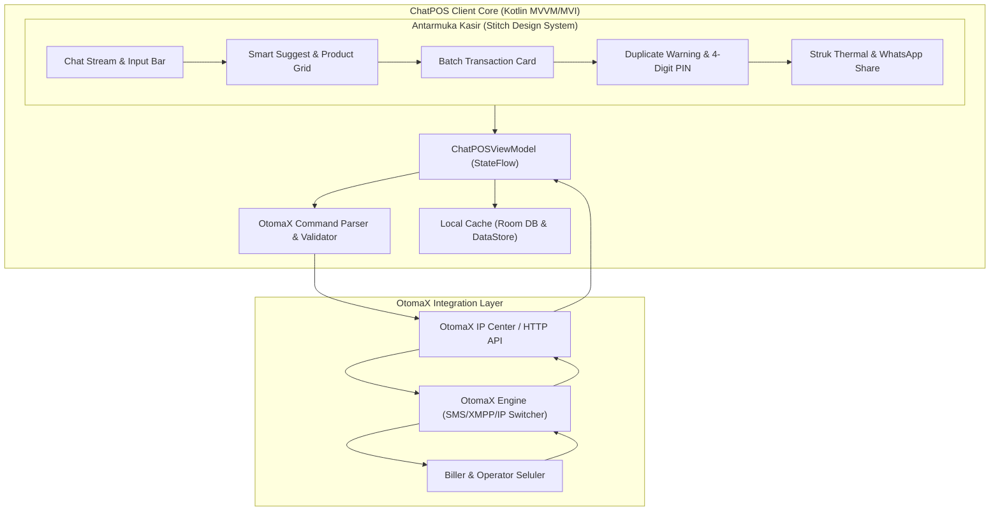

# 🚀 Dokumen Perencanaan Berkala: ChatPOS (Kotlin + OtomaX)

Dokumen ini merupakan cetak biru (blueprint) dan rencana kerja bertahap untuk pengembangan aplikasi **ChatPOS**, aplikasi Point-of-Sale (POS) dan transaksi elektronik berbasis chat interaktif dalam bahasa pemrograman **Kotlin (Jetpack Compose)** yang terintegrasi dengan engine server pulsa & PPOB **OtomaX**.

---

## 📌 1. Visi & Arsitektur Utama

ChatPOS menggabungkan kecepatan antarmuka berbasis pesan (seperti Telegram/WhatsApp) dengan kepastian data finansial modern. Kasir konter dapat mengetik perintah singkat (misal: `#cust001 S10.08951234`), memilih dari grid nominal cepat, atau membiarkan sistem menyarankan nomor pelanggan langganan secara cerdas.

---

## 🗓️ 2. Roadmap Pengembangan Berkala

### 🎨 FASE 1: Implementasi Tampilan & UI/UX (Sesuai Folder `stitch` & `implementasi plan`)
> **Durasi:** Sprint 1 - 2 (Pondasi UI Lengkap)  
> **Fokus:** Mengonversi 11 rancangan layar/komponen dari folder `stitch` ke Jetpack Compose murni.

**Revisi Fase 1 aktif:** welcome card hanya tampil sebelum ada transaksi, input chat memakai
cursor otomatis di posisi akhir, hint input mengikuti tahap pengisian, submit chat membuat
preview transaksi terlebih dahulu, dan tombol **Proses Sekarang** baru meneruskan satu batch
ke sistem. Balasan bot diringkas menjadi satu card untuk setiap pengiriman. Bubble chat
mengikuti pola WhatsApp dengan warna pengirim dan sistem yang berbeda, tombol aksi berada di
bawah bubble dan tampil saat card balasan dipilih, serta assistant input menyediakan kategori
produk selain Pulsa.

**Revisi Fase 1 lanjutan:** card draft memakai tombol **Edit** untuk mengembalikan nilai
transaksi ke input chat, bubble balasan sistem berwarna putih dan rata kiri, bubble transaksi
menampilkan identitas pelanggan `#cust001`, dan pengiriman WhatsApp menyediakan pilihan satu
nota gabungan atau nota terpisah untuk setiap item. Ikon lampiran dan keypad di input chat
dihapus. Header card draft menampilkan `#cust001` sebagai identitas utama dengan garis
pemisah, header balasan sistem menggunakan label **BALASAN SERVER**, waktu memakai format
`HH:mm`, dan setiap item transaksi menampilkan statusnya.

| Modul Layar / Komponen | Referensi Folder `stitch` | Deskripsi & Komponen Compose |
| :--- | :--- | :--- |
| **Design System & Tokens** | `conversational_retail_pos` | `Color.kt`, `Type.kt` (Plus Jakarta Sans + Inter), `Shape.kt`, `Dimensions.kt`, `Theme.kt` |
| **Main Screen & App Bar** | `pos_konter_chat_mobile_pos_app` | Header "TOKO BERKAH CELL", status Online, indikator saldo Rp 1.417.000, lazy chat list |
| **Katalog & Pilihan Produk** | `pos_konter_pilihan_produk` | `ProductNominalGrid`: Denom 5K, 10K, 20K, 25K, 50K, 100K + Tab Kategori (Pulsa, Data, PLN, dll.) |
| **Smart Contact Suggest** | `pos_konter_smart_suggest_nomor_089566` | Dropdown sugesti otomatis saat kasir mengetik nomor awalan `0895...` |
| **Batch Transaction Card** | `pos_konter_batch_transaction_card` | Kartu ringkasan transaksi multi-item dengan status dot (draft/processing/sukses) |
| **Peringatan Nomor Duplikat** | `pos_konter_duplicate_target_warning` | Warning Card aksen amber `#FFFBEB` saat nomor tujuan sama diinput dalam 15 menit |
| **Mode Edit Transaksi** | `pos_konter_edit_input_chat` | Reordering item drag-and-drop & tombol hapus item transaksi |
| **Konfirmasi PIN 4 Digit** | `pos_konter_konfirmasi_pin_4_digit` | Bottom Sheet modal dengan indikator bullet PIN dan keypad numerik kustom |
| **Balasan Sukses Sistem** | `pos_konter_transaksi_sukses_balasan_sistem` | Kartu hijau balasan sukses berisi SN OtomaX, Ref ID, Saldo sisa, & shortcut nota |
| **Preview Cetak Struk** | `pos_konter_cetak_struk_preview_nota_terpisah` | Tampilan kertas nota bergerigi (sawtooth edge) untuk printer thermal 58mm |
| **Bagi Nota WhatsApp** | `pos_konter_kirim_whatsapp_nota_terpisah` | Modal kirim rincian nota terpisah langsung ke nomor WA pelanggan |

---

### 🧠 FASE 2: ViewModel & State Management
- Implementasi `ChatPOSViewModel` dengan StateFlow reaktif.
- Pengelolaan state transaksi: `DRAFT`, `PENDING_PIN`, `PROCESSING_OTOMAX`, `SUCCESS`, `DUPLICATE_WARNING`, `FAILED`.
- Parser teks chat instan: mengekstrak format `[KODE].[TUJUAN]` (contoh: `S10.089512345678`).

---

### 🔌 FASE 3: Integrasi Engine OtomaX
- **Protokol Transaksi OtomaX IP Center**:
  - Format request HTTP GET/POST: `http://[IP_OTOMAX]:[PORT]/api/trx?memberid=[ID]&pin=[PIN]&kodeproduk=[KODE]&tujuan=[NO_HP]&refid=[UUID]`
  - Format Balasan OtomaX:
    - *Sukses*: `Trx [KODE] ke [TUJUAN] SUKSES. SN: 1234567890. Sisa Saldo: Rp 1.406.000`
    - *Pending*: `Trx [KODE] ke [TUJUAN] SEDANG DIPROSES. Ref: TRX987`
    - *Gagal*: `Trx [KODE] ke [TUJUAN] GAGAL. Saldo tidak mencukupi / Nomor salah.`
- Polling status otomatis untuk transaksi pending & idempotency protection via RefID unik.

---

### 🖨️ FASE 4: Integrasi Hardware POS & Bagikan Struk
- Driver ESC/POS Thermal Printer Bluetooth (Bluetooth SPP RFCOMM).
- Formatter teks struk kasir dengan opsi cetak nota terpisah per item transaksi.
- Intent integrasi WhatsApp (`https://api.whatsapp.com/send?phone=...&text=...`).

---

### 🛡️ FASE 5: Pengujian, Keamanan & Deployment
- Proteksi PIN tersimpan di Android Keystore / EncryptedSharedPreferences.
- Deteksi Root / Device Tampering untuk perlindungan saldo dompet agen.
- Build APK Debug & Release (ProGuard / R8 enabled).
